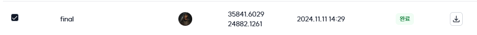

# 🕵️‍♂️ House Price Prediction | 아파트 실거래가 예측

 <br/>

## 🌟 소개
서울 아파트 실거래가 예측을 위한 모델 개발을 목표로 합니다.<br/><br/>

## 🚀 프로젝트 특징
- 부동산은 의식주에서의 주로 중요한 요소 중 하나입니다. 이러한 부동산은 아파트 자체의 가치도 중요하고, 주변 요소 (강, 공원, 백화점 등)에 의해서도 영향을 받아 시간에 따라 가격이 많이 변동합니다. 개인에 입장에서는 더 싼 가격에 좋은 집을 찾고 싶고, 판매자의 입장에서는 적절한 가격에 집을 판매하기를 원합니다. 부동산 실거래가의 예측은 이러한 시세를 예측하여 적정한 가격에 구매와 판매를 도와주게 합니다. 그리고, 정부의 입장에서는 비정상적으로 시세가 이상한 부분을 체크하여 이상 신호를 파악하거나, 업거래 다운거래 등 부정한 거래를 하는 사람들을 잡아낼 수도 있습니다. 

저희는 이러한 목적 하에서 다양한 부동산 관련 의사결정을 돕고자 하는 부동산 실거래가를 예측하는 모델을 개발하는 것입니다. 특히, 가장 중요한 서울시로 한정해서 서울시의 아파트 가격을 예측하려고합니다.<br/><br/>

- input : 9,272개의 아파트 특징 및 거래정보
- output : 9,272개의 input에 대한 예상 아파트 거래금액

<p align="center">  </p>
  
### 📌 의존성 설치
모든 필요한 패키지는 environment.yml에 정의되어 있습니다.<br/><br/>

## 📝 사용 방법
메인 스크립트를 실행하여 데이터를 분석하고 시각화합니다:<br/><br/>

## 📂 프로젝트 구조
```bash
upstageailab5-ml-regression-ml_r1/
├── data/
│   ├── interest_rate.csv
│   ├── bus_feature.csv
│   └── output_final_v2.csv
├── images/
│   ├── 1.jpg
│   ├── team1.png
│   ├── team2.png
│   ├── team3.png
│   ├── team4.png
│   ├── team5.png
│   └── result.png
├── modules/
│   ├── main_final.py
│   └── real_estate_final.ipynb
├── .gitignore
├── environment.yml
├── README.md
└── tests/
    └── test_main.py
```

- **data/:** 데이터 파일들이 위치하는 디렉토리<br/>
- **images/:** README 및 결과물에 사용되는 이미지<br/>
- **modules/:** 기능별 클래스 모듈<br/>
- **tests/:** 유닛 테스트 코드<br/><br/>

- **국토교통부 실거래가 : 정부 3.0 및 공공데이터 개방/:** [(https://rt.molit.go.kr/pre.html)]
- **서울시 공공주택 아파트 정보 : CC BY/:** [(https://data.seoul.go.kr/dataList/OA-15818/S/1/datasetView.do)]

## 🌈 결과 예시<br/>
## 📊 RMSE 결과값
Train 데이터로 학습하여 Test 데이터의 Target 값을 예측한 RMSE 값
<p align="center">  </p>


## 👥 팀원 소개
|  |  |  |  |  |
| :--------------------------------------------------------------: | :--------------------------------------------------------------: | :--------------------------------------------------------------: | :--------------------------------------------------------------: | :--------------------------------------------------------------: |
|            [김기정](https://github.com/code-squire)             |            [최종환](https://github.com/choi-jonghwan-salgabda)             |            [신다혜](https://github.com/miso2203)             |            [유영신](https://github.com/ysyou1082)             |            [김동완](https://github.com/booobing)             |
|                            팀장, 데이터 수집 및 분석                             |                            데이터 수집 및 분석                             |                            데이터 분석 및 모델 테스트                             |                            모델 최적화 및 테스트                             |                            데이터 분석                             |

